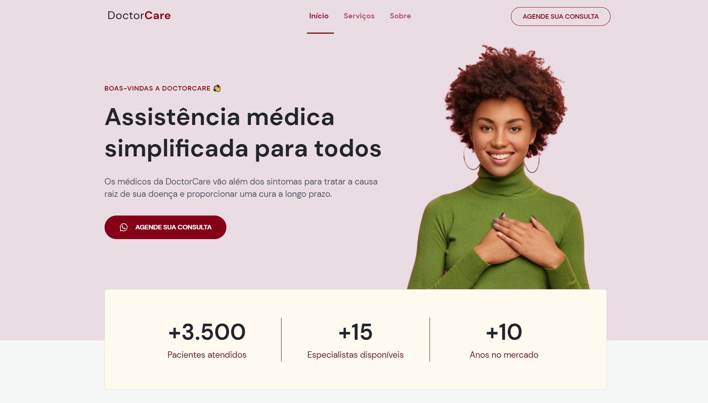

<h1>DoctorCare</h1>

## 📚 About

DoctorCare é um website desenvolvido durante a semana do evento **NLW Return**. Abordando conceitos de Mobile first e unidades de medida flexiveis como REM. Projeto totalmente responsivo, adaptado para qualquer smartphone ou table, e também Web.

## 🛠 Tools

- [HTML](https://developer.mozilla.org/pt-BR/docs/Web/HTML)
- [CSS](https://developer.mozilla.org/pt-BR/docs/Web/CSS)
- [JavaScript](https://developer.mozilla.org/pt-BR/docs/Web/JAVASCRIPT)

## 🧾license

This project is under the MIT license. See the file LISENSE for more details.

<h1 align="center">
<a href="https://doctorcare-br.netlify.app/">See the site</a>
</h1>
